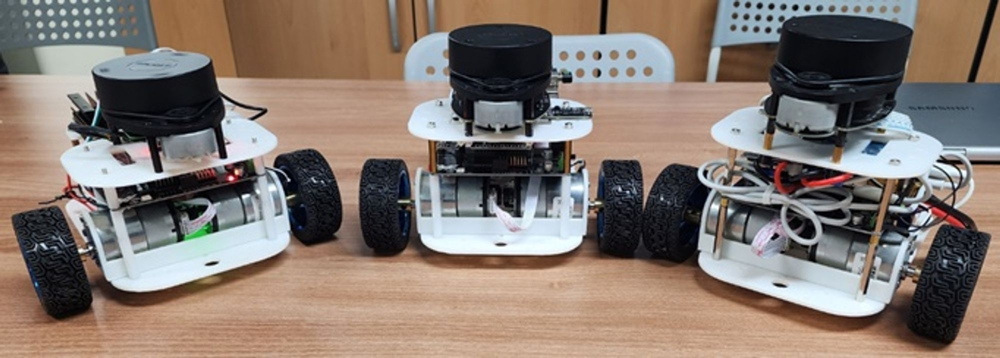
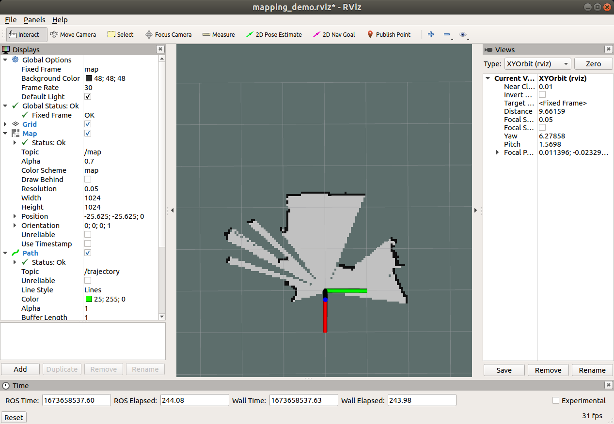
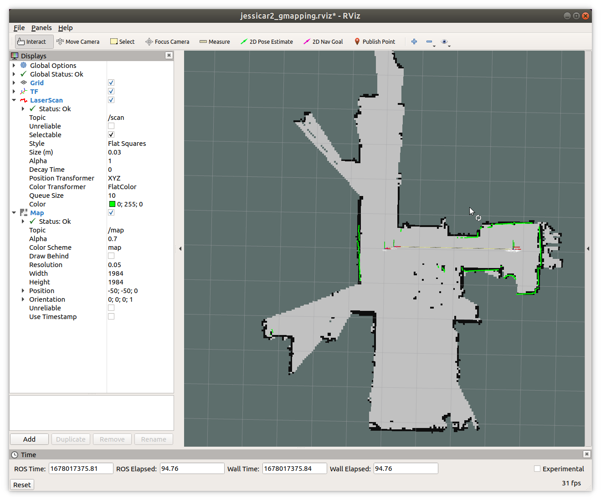
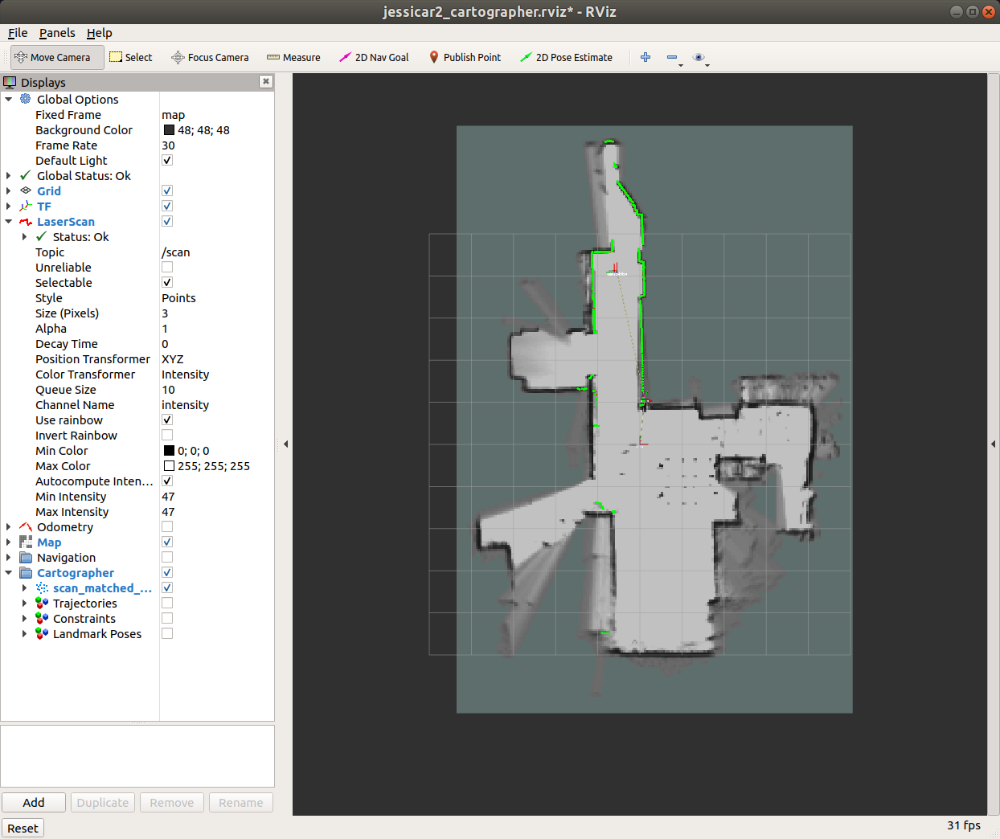

# Jessicar2 DIY ROS navigation Robot
This project is about ROS Package for Jessicar2 DIY robot  
Robot 3D model, BOM: Byungki  
Circuit: Byungki, ZETA7  
Aruduino scketch: ZETA7  
ROS code: ZETA7  

# Especially Thanks
Automatic Addision: https://automaticaddison.com/how-to-set-up-the-ros-navigation-stack-on-a-robot/  
OMO R1 Mini: https://github.com/omorobot/omo_r1mini#readme  
ROBOTIZ: https://github.com/ROBOTIS-GIT/turtlebot3
Other Open Source sites   

## Overview
<div align="center">
  
</div>

## Circuit Block Diagram

<div align="center">
  
</div>

## Installation
Please download image from below location   
[jp451_2G_opencv346_64G.zip](https://drive.google.com/file/d/1UN2qikaxQqpnegdXYcd6U0yeBi4iRlJm/view?usp=sharing)

```bash
id: jetson
passwd: jetson
```
Please follow instruction on blow Notion(in Korean)   
https://zeta7.notion.site/Jessicar-II-ec829f83c37241bda40e59cbeca561d7

## Additional packages

Below pacakges are maybe required run this package and are located in ROBOT's **catkin_ws/src** folder
- https://github.com/Slamtec/rplidar_ros.git to run RpLidar


## Dependency

In order to run all the packages included in this project, you may need to install additional ROS packages as below.

```
sudo apt-get install ros-melodic-tf ros-melodic-joy \
ros-melodic-teleop-twist-joy \
ros-melodic-teleop-twist-keyboard \
ros-melodic-laser-proc ros-melodic-rgbd-launch \
ros-melodic-depthimage-to-laserscan \
ros-melodic-rosserial-arduino ros-melodic-rosserial-python \
ros-melodic-rosserial-server ros-melodic-rosserial-client \
ros-melodic-rosserial-msgs ros-melodic-amcl \
ros-melodic-map-server ros-melodic-move-base \
ros-melodic-urdf ros-melodic-xacro ros-melodic-usb-cam \
ros-melodic-compressed-image-transport \
ros-melodic-rqt-image-view ros-melodic-gmapping \
ros-melodic-navigation ros-melodic-interactive-markers \
ros-melodic-ar-track-alvar ros-melodic-ar-track-alvar-msgs \
ros-melodic-cartographer-ros
```

## Running the Robot

To simply run the robot to control with teleop keyboard command, enter below while roscore is running in the **HOST PC**

```
$ roslaunch jessicar2_bringup arduino_bringup.launch

$ roslaunch jessicar2_teleop jessicar2_teleop_joy.launch
or
$ roslaunch jessicar2_teleop jessicar2_teleop_key.launch

```
This allows you to move the robot simply by keyboard input as
```
- W: Move FWD (Increase lin_vel.x)
- A: Turn Left (Increase rot_vel.z)
- S: Stop (Reset lin_vel.x, rot_vel.z)
- D: Turn Right (Decrease rot_vel.z)
- X: Move REV (Decrease lin_vel.x)
```

## SLAM Mapping  

### Mapping using Hector Slam

<div align="center">
  
</div>

To run 2D lidar based SLAM navigation, simply launch below in ROBOT.  

```
$ roslaunch jessicar2_slam jessicar2_hectorslam.launch
```

Launch below in HOST PC to open rviz environment to make map.  
```
$ roslaunch jessicar2_slam jessicar2_hectorslam_rviz.launch

roslaunch jessicar2_teleop jessicar2_teleop_key.launch
# or
roslaunch jessicar2_teleop jessicar2_teleop_joy.launch
```
Move the robot using keyboard input (W: FWD, A: Left, D: Right, X: REV) and the map will be expanded as it go.

### Mapping using Gmapping

<div align="center">
  
</div>

To run 2D lidar based SLAM navigation, simply launch below in ROBOT.  

```
$ roslaunch jessicar2_slam jessicar2_gmapping.launch
```

Launch below in HOST PC to open rviz environment to make map.  
```
$ roslaunch jessicar2_slam jessicar2_gmapping_rviz.launch

$ roslaunch jessicar2_teleop jessicar2_teleop_key.launch
# or
$ roslaunch jessicar2_teleop jessicar2_teleop_joy.launch
```

### Mapping using Cartographer ROS

Cartographer generate maps smoother and more precise compare to gmapping and support for various type of sensors such as Depth camera or 3D lidar.  

More information can be found its website.

https://google-cartographer-ros.readthedocs.io/en/latest/

To run cartographer-ros, simply launch below in ROBOT.

```
$ roslaunch jessicar2_slam jessicar2_cartographer.launch
```

Launch below in HOST PC to run rviz environment and robot control.  
```
$ roslaunch jessicar2_slam jessicar2_cartographer_rviz.launch

$ roslaunch jessicar2_teleop jessicar2_teleop_key.launch
or
$ roslaunch jessicar2_teleop jessicar2_teleop_key.launch
```
<div align="center">
  
</div>

### Save map file

Once map is fully generated, run map_server to save **<name_of_map>.yaml** and **<name_of_map>.pgm** files as below.

```
$ rosrun map_server map_saver -f <name_of_map>
```
Terminate all nodes and copy these files and place into ROBOT's ~/catkin_ws/src/jessicar2/jessicar2_navigation/maps

## Navigation
<iframe width="1098" height="618" src="https://www.youtube.com/embed/BB2lmuOR4zw" title="ROS1 navigation with DIY two wheel robot" frameborder="0" allow="accelerometer; autoplay; clipboard-write; encrypted-media; gyroscope; picture-in-picture; web-share" allowfullscreen></iframe>   

To start navigation launch below in ROBOT.  

```
$ roslaunch jessicar2_navigation jessicarNavi.launch
```
Then launch below in HOST PC to open the robot in rviz environment.  
```
$ roslaunch jessicar2_navigation jessicarNavi_rviz.launch
```

Place the robot in the map by selecting green arrow(**2D Pose Estimate**) in the top menu and **pick**(Location) and **drag**(direction) where the robot likely to be and its direction in the map.

Now place a **goal** by selecting Pink arrow(**2D Nav Goal**) in the top menu and **pick**(Goal location) and **drag**(Goal direction) where the robot should go in the map.

Wait until the robot reaches the goal!

---

Jessicar2 team